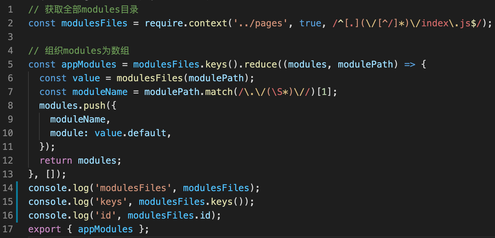
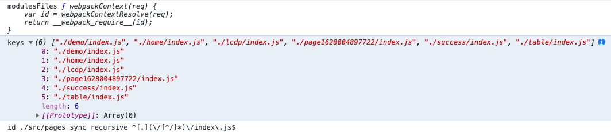

### 什么是require.context
  一个webpack的api,通过执行require.context函数获取一个特定的上下文,主要用来实现自动化导入模块,在前端工程中,如果遇到从一个文件夹引入很多模块的情况,可以使用这个api,它会遍历文件夹中的指定文件,然后自动导入,使得不需要每次显式的调用import导入模块。

### require.context使用场景

```javascript
import home from '../page/home';
import demo from '../page/demo';
import lcdp from '../page/lcdp';
import table from '../page/table';
import form from '../page/form';
import detail from '../page/detail';
```

可以使用require.context：

```javascript
// 获取全部modules目录
const modulesFiles = require.context('../pages', true, /^[.](\/[^/]*)\/index\.js$/);

// 组织modules为数组
const appModules = modulesFiles.keys().reduce((modules, modulePath) => {
  const value = modulesFiles(modulePath);
  const moduleName = modulePath.match(/\.\/(\S*)\//)[1];
  modules.push({
    moduleName,
    module: value.default,
  });
  return modules;
}, []);

export { appModules };
```

### require.context使用方法

require.context函数接受三个参数：
1. directory {String} -读取文件的路径
2. useSubdirectories {Boolean} -是否遍历文件的子目录
3. regExp {RegExp} -匹配文件的正则

eg: ``` require.context('./test', false, /.test.js$/);```

require.context()执行后返回是一个函数：
```javascript
 webpackContext(req) {
	var id = webpackContextResolve(req);
	return __webpack_require__(id);
}
```
并且这个函数有三个属性：

1. resolve {Function} -接受一个参数request,request为test文件夹下面匹配文件的相对路径,返回这个匹配文件相对于整个工程的相对路径
2. keys {Function} -返回匹配成功模块的名字组成的数组
3. id {String} -执行环境的id,返回的是一个字符串,主要用在module.hot.accept,应该是热加载?

打印这三个属性：






