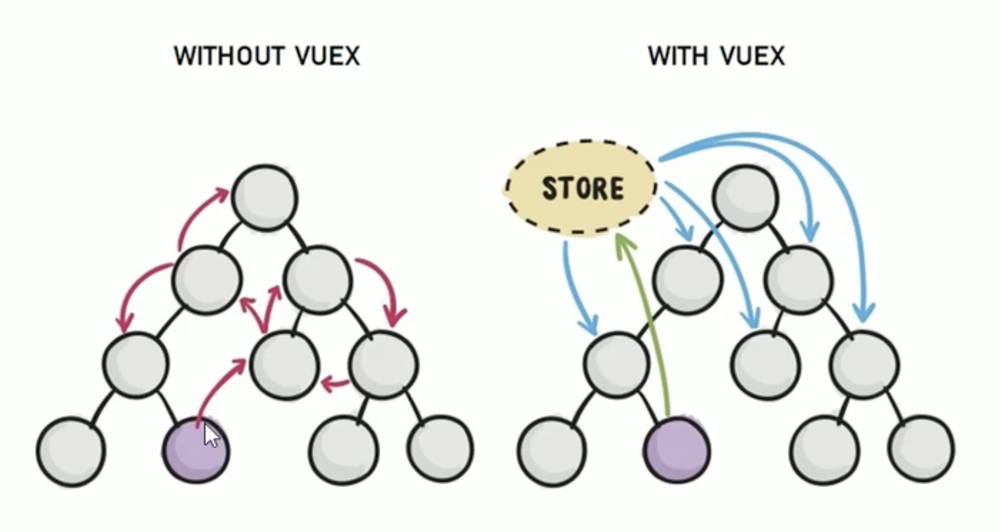

官方文档： https://vuex.vuejs.org/zh/

### 1 vuex概述
组件之间共享数据的方式
- 父->子：v-bind
- 子->父：v-on
- 兄弟之间共享数据：EventBus
只适用于小范围共享。

vuex是一个状态管理模式，适用于多个组件共享同一状态时的场景，这里状态也可以理解为数据变量。

<div align=center>

<!--  -->
</div>

使用vuex好处：
- 能够在vuex中集中管理共享的数据，易于开发和后期维护
- 能够高效地实现组件之间的数据共享，提高开发效率
- 存储在vuex中的数据都是响应式的，能够实时保持数据与页面的同步

### 2 vuex核心概念
#### state: 提供唯一公共数据源，所有共享的数据都要放到Store中进行存储

```
const store = new Vuex.store({
  state: {
    count: 0,
  }
});
```
两种访问state数据方式：
1.直接在需要用的地方使用"$store.state.***"
2. 先引入mapState,再使用
import { mapState } from vuex;
computed: {
  ...mapState(['count']),
},

#### Mutation
Mutation用于改变store中的数据,只能处理同步任务，不能执行异步操作
- 只能通过Mutation变更store数据，不可以直接在组件中操作store数据
- 这种方式虽然操作繁琐一些，但是可以集中监听所有数据的变化
```
// 定义Mutation
const store  = new Vuex.store({
  state: {
    count: 0,
  },
  mutations: {
    add(state, step) {
      state.count += step;
    },
  },
});

//触发mutation: 第一种方式
methods: {
  handle1() {
    this.$store.commit('add', 3);
  },
},
//触发mutation：第二种方式

import { mapMutations } from vuex;
methods: {
  ...mapMutations(['add']),
  handle2() {
    this.add(3);
  },
},
```

#### Action
Action用于处理异步任务。
注意：
- 如果通过异步操作变更数据，必须通过Action，而不能使用Mutation，但是在Action中还是要通过触发Mutation的方式间接变更数据。
- Action不能直接修改state数据，必须通过commit触发mutation才行

```
//定义Action
const store = new Vuex.store({
  mutations: {
    add(state, step) {
      state.count += step;
    },
  },
  actions: {
    addAsync(context, step) {
      // Action不能直接修改state数据，必须通过commit触发mutation才行
      setTimeout(() => {
        context.conmmit('add', step);
      }, 1000);
    },
  },
});

// 触发Action: 第一种方式
methods: {
  handle3() {
    this.$store.dispatch('addAsync', 3);
  },
},

// 触发Action:第二种方式
import { mapActions } from 'vuex';
methods: {
  ...mapActions(['addAsync']),
  handle4() {
    this.addAsync(3);
  },
},
```
#### Getter
getter用于对store中的数据进行加工处理形成新的数据。
- getter可以对store中已有的数据加工处理之后形成新的数据，类似于vue的计算属性
- getter中所依赖的store中的数据发生变化时，getter的数据也会发生变化

```
// 定义getter
const store = new Vuex.store({
  state: {
    count: 0,
  },
  getters: {
    showNum: (state) => {
      return state.count++;
    },
  },
});

// 第一种使用方式
methods: {
  handle5() {
    return this.$store.getter('showNum');
  },
},

/ 第二种使用方式
import { mapGetters } from 'vuex';
computed: {
  ...mapGetters(['showNum']),
},
```


